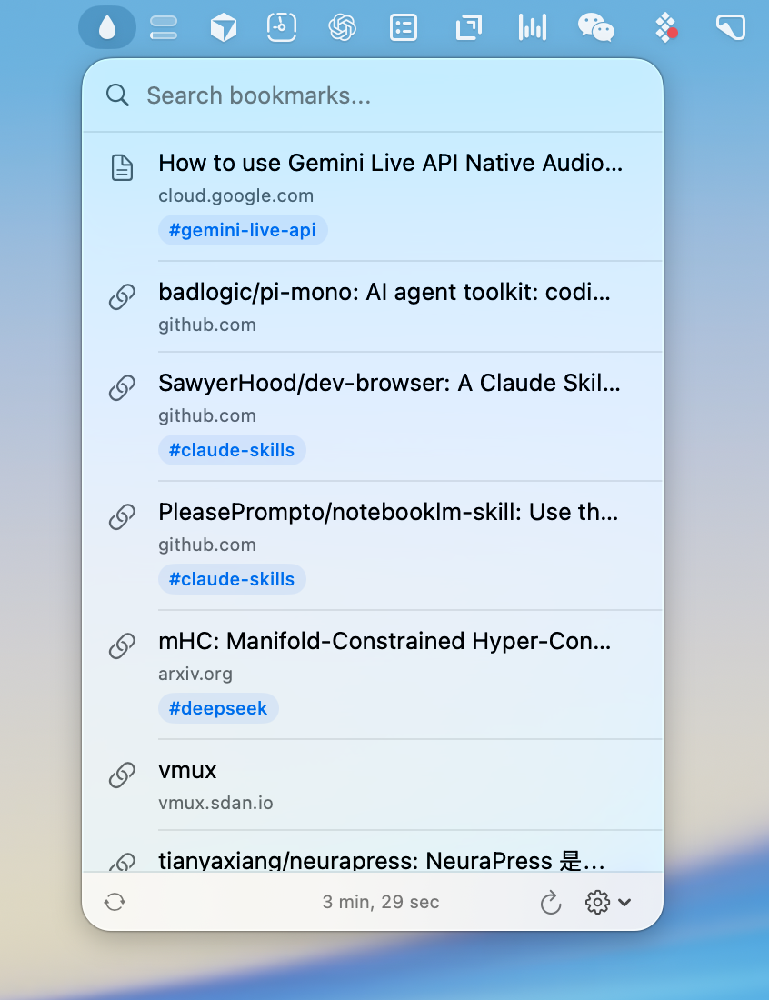

# RainDrop Bar

A macOS menubar app for quick access to your [Raindrop.io](https://raindrop.io) bookmarks.



## Features

- Syncs bookmarks from Raindrop.io to local storage
- Quick search across all bookmarks
- Organized by collections
- Auto-sync every 15 minutes
- Secure token storage via Keychain

## Requirements

- macOS 26.0+
- Xcode 26+
- Raindrop.io API token ([get one here](https://app.raindrop.io/settings/integrations))

## Setup

1. Clone and open in Xcode:
   ```bash
   open RainDropBar.xcodeproj
   ```

2. Build and run (⌘R)

3. Click the menubar icon → Settings → Enter your API token

## Tech Stack

- SwiftUI
- SwiftData
- Keychain Services

## License

MIT
